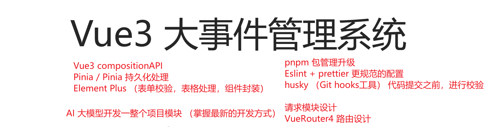
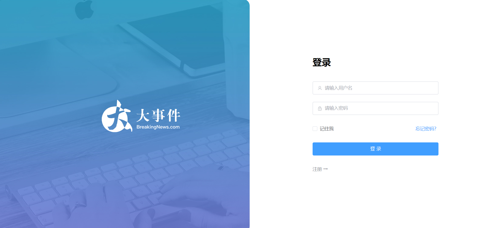
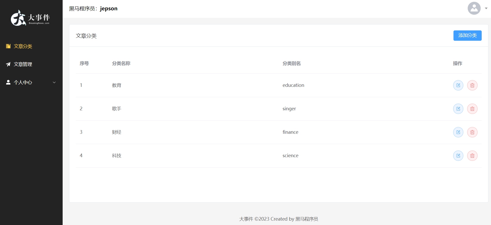
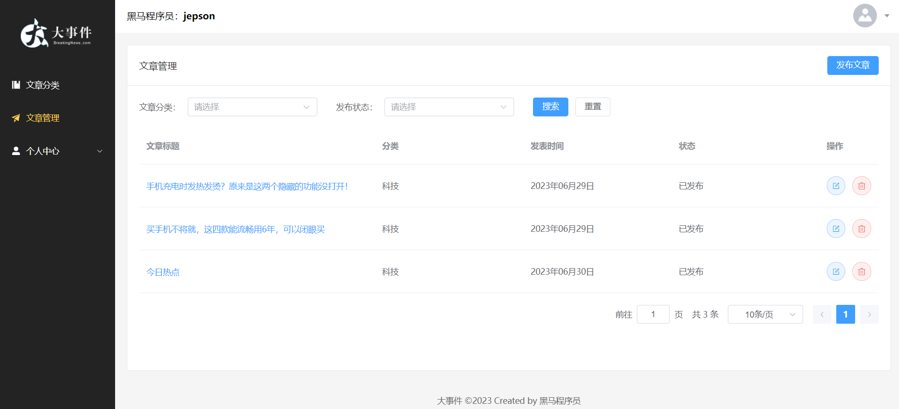
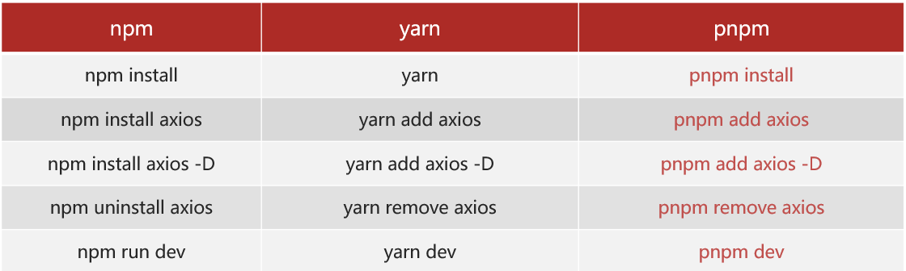
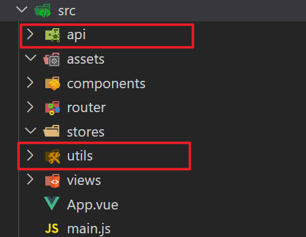
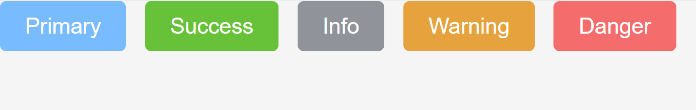
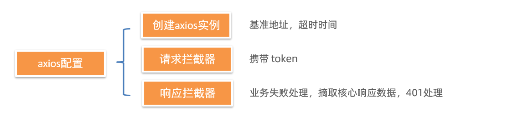
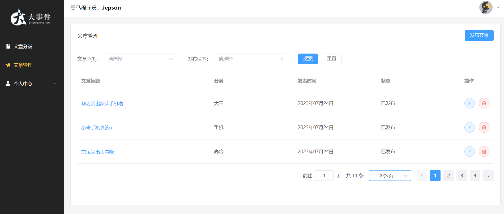

# 后台数据管理系统 - 项目架构设计

在线演示：<https://fe-bigevent-web.itheima.net/login>

接口文档: <https://apifox.com/apidoc/shared-26c67aee-0233-4d23-aab7-08448fdf95ff/api-93850835>

**接口根路径：** <http://big-event-vue-api-t.itheima.net>

本项目的技术栈 本项目技术栈基于 [ES6](http://es6.ruanyifeng.com/)、[vue3](https://cn.vuejs.org/index.html)、[pinia](https://pinia.web3doc.top/)、[vue-router](https://router.vuejs.org/) 、vite 、axios 和 [element-plus](https://element-plus.org/)



## 项目页面介绍








## pnpm 包管理器 - 创建项目

一些优势：比同类工具快 2倍 左右、节省磁盘空间... <https://www.pnpm.cn/>

安装方式：

```
npm install -g pnpm
```

创建项目：

```
pnpm create vue
```



## ESLint & prettier 配置代码风格

**环境同步：**

1. **安装了插件 ESlint，开启保存自动修复**
2. **禁用了插件 Prettier，并关闭保存自动格式化**

```jsx
// ESlint插件 + Vscode配置 实现自动格式化修复
"editor.codeActionsOnSave": {
    "source.fixAll": true
},
"editor.formatOnSave": false,
```

**配置文件 .eslintrc.cjs**

1. prettier 风格配置 [https://prettier.io](https://prettier.io/docs/en/options.html)
   1. 单引号

   2. 不使用分号

   3. 每行宽度至多80字符

   4. 不加对象|数组最后逗号

   5. 换行符号不限制（win mac 不一致）

2. vue组件名称多单词组成（忽略index.vue）

3. props解构（关闭）

eslint.config.js

```js
// .eslintrc.js (ESM 格式，适配 package.json 中的 "type": "module")
// 核心：ESLint v9+ 扁平配置，整合 Prettier 格式化 + Vue 校验 + Oxlint 增强
import { defineConfig } from 'eslint/config' // 导入 ESLint 扁平配置核心方法
import globals from 'globals' // 导入全局变量预设（如 browser、node 等）
import js from '@eslint/js' // 导入 ESLint 官方内置的 JavaScript 规则集
import pluginVue from 'eslint-plugin-vue' // 导入 Vue 专属 ESLint 插件
import pluginOxlint from 'eslint-plugin-oxlint' // 导入 Oxlint 增强插件（高性能校验）
import pluginPrettier from 'eslint-plugin-prettier' // 导入 Prettier 集成插件（让 Prettier 规则作为 ESLint 规则生效）
import eslintConfigPrettier from 'eslint-config-prettier/flat' // 导入禁用 ESLint 内置格式化规则的配置（避免与 Prettier 冲突）

// 导出 ESLint 扁平配置（数组形式，按顺序执行，后执行的规则优先级更高）
export default defineConfig([
  // 1. 配置文件检测范围与忽略规则
  {
    name: 'app/files-to-lint', // 配置名称（便于区分配置模块）
    files: ['**/*.{vue,js,mjs,jsx}'], // 指定需要校验的文件类型
    ignores: [
      // 指定忽略校验的文件/目录（构建产物、测试覆盖率报告等）
      '**/dist/**',
      '**/dist-ssr/**',
      '**/coverage/**',
    ],
  },

  // 2. 基础语言环境配置
  {
    languageOptions: {
      // 语言相关配置项
      globals: { ...globals.browser }, // 注入浏览器环境的全局变量（如 window、document 等）
      ecmaVersion: 'latest', // 支持最新的 ES 语法特性
      sourceType: 'module', // 指定代码模块类型为 ESM（适配项目 "type": "module"）
    },
  },

  // 3. 优先禁用 ESLint 内置格式化规则
  // 关键：必须在其他规则前执行，避免 ESLint 内置的格式化规则与 Prettier 冲突
  eslintConfigPrettier,

  // 4. 引入基础规则集（无自定义覆盖时，使用官方推荐规则）
  js.configs.recommended, // ESLint 官方推荐的 JavaScript 基础规则（如禁止未定义变量、禁止重复声明等）
  ...pluginVue.configs['flat/essential'], // 解构引入 Vue 核心必要规则（如模板语法校验、组件规范等）

  // 5. 引入 Oxlint 规则（从配置文件读取，高性能补充校验）
  ...pluginOxlint.buildFromOxlintConfigFile('.oxlintrc.json'),

  // 6. 自定义规则（优先级最高，会覆盖前面的基础规则）
  {
    plugins: { prettier: pluginPrettier }, // 注册 Prettier 插件
    rules: {
      // Prettier 格式化规则（设为 error 级别，强制生效）
      'prettier/prettier': [
        'error', // 级别：error（报错），确保保存时自动修复，warn 可能被忽略
        {
          singleQuote: true, // 强制使用单引号
          semi: false, // 语句末尾不添加分号
          printWidth: 80, // 每行代码最大宽度 80 字符
          trailingComma: 'none', // 对象/数组最后一个元素后不添加逗号
          endOfLine: 'auto', // 换行符自动适配（兼容 Windows/macOS 不同换行符）
        },
      ],
      // Vue 组件命名规则：要求多单词（避免与 HTML 原生标签冲突）
      'vue/multi-word-component-names': [
        'warn', // 级别：warn（警告），不阻断构建/提交
        { ignores: ['index'] }, // 忽略 index.vue 组件（常见的入口组件命名）
      ],
      // 关闭 Vue props 解构限制（允许在 setup 中解构 props，提升开发体验）
      'vue/no-setup-props-destructure': 'off',
      // 未定义变量报错（强制声明变量后使用，避免拼写错误）
      'no-undef': 'error',
    },
  },
])
```

## 基于 husky 的代码检查工作流

husky 是一个 git hooks 工具 ( git的钩子工具，可以在特定时机执行特定的命令 )

### husky 配置

1. git初始化 git init

2. 初始化 husky 工具配置 <https://typicode.github.io/husky/>

   ```jsx
   pnpm dlx husky-init && pnpm install
   ```

3. 修改 .husky/pre-commit 文件

   ```jsx
   pnpm lint
   ```

**问题**:默认进行的是全量检查，耗时问题，历史问题。

### lint-staged 配置

1. 安装

   ```jsx
   pnpm i lint-staged -D
   ```

2. 配置 `package.json`

   ```jsx
   {
     // ... 省略 ...
     "lint-staged": {
       "*.{js,ts,vue}": [
         "eslint --fix"
       ]
     }
   }

   {
     "scripts": {
       // ... 省略 ...
       "lint-staged": "lint-staged"
     }
   }
   ```

3. 修改 .husky/pre-commit 文件

   ```jsx
   pnpm lint-staged
   ```

## 调整项目目录

默认生成的目录结构不满足我们的开发需求，所以这里需要做一些自定义改动。主要是两个工作：

- 删除初始化的默认文件
- 修改剩余代码内容
- 新增调整我们需要的目录结构
- 拷贝初始化资源文件，安装预处理器插件

1. 删除文件

2. 修改内容

   `src/router/index.js`

   ```jsx
   import { createRouter, createWebHistory } from 'vue-router'

   const router = createRouter({
     history: createWebHistory(import.meta.env.BASE_URL),
     routes: [],
   })

   export default router
   ```

   `src/App.vue`

   ```jsx
   <script setup></script>

   <template>
     <div>
       <router-view></router-view>
     </div>
   </template>

   <style scoped></style>
   ```

   `src/main.js`

   ```jsx
   import { createApp } from 'vue'
   import { createPinia } from 'pinia'

   import App from './App.vue'
   import router from './router'

   const app = createApp(App)

   app.use(createPinia())
   app.use(router)
   app.mount('#app')
   ```

3. 新增需要目录 api utils

   

4. 将项目需要的全局样式 和 图片文件，复制到 assets 文件夹中, 并将全局样式在main.js中引入

   ```jsx
   import '@/assets/main.scss'
   ```

- 安装 sass 依赖

  ```jsx
  pnpm add sass -D
  ```

## VueRouter4 路由代码解析

基础代码解析

```jsx
import { createRouter, createWebHistory } from 'vue-router'

// createRouter 创建路由实例，===> new VueRouter()
// 1. history模式: createWebHistory()   http://xxx/user
// 2. hash模式: createWebHashHistory()  http://xxx/#/user

// vite 的配置 import.meta.env.BASE_URL 是路由的基准地址，默认是 ’/‘
// https://vitejs.dev/guide/build.html#public-base-path

// 如果将来你部署的域名路径是：http://xxx/my-path/user
// vite.config.ts  添加配置  base: my-path，路由这就会加上 my-path 前缀了

const router = createRouter({
  history: createWebHistory(import.meta.env.BASE_URL),
  routes: [],
})

export default router
```

import.meta.env.BASE_URL 是Vite 环境变量：[https://cn.vitejs.dev/guide/env-and-mode.html](https://cn.vitejs.dev/guide/env-and-mode.html)

```vue
<script setup>
import { useRouter, useRoute } from 'vue-router'

//在Vue3 CompositionAPI中
//1.获取路由对象router
//const router useRouter()
//2.获取路由参数route
//const route = useRoute()

const router = useRouter()
const route = useRoute()

const goAbout = () => {
  router.push('/about')
  console.log(router, route)
}
</script>

<template>
  <div>我是App.vue</div>
  <button @click="$router.push('/home')">跳转首页</button>
  <button @click="goAbout">跳转关于页</button>
</template>

<style scoped></style>
```

## 引入 element-ui 组件库

**官方文档：** <https://element-plus.org/zh-CN/>

- 安装

```jsx
pnpm add element-plus
```

**自动按需：**

1. 安装插件

```jsx
pnpm add -D unplugin-vue-components unplugin-auto-import
```

1. 然后把下列代码插入到你的 `Vite` 或 `Webpack` 的配置文件中

```jsx
...
import AutoImport from 'unplugin-auto-import/vite'
import Components from 'unplugin-vue-components/vite'
import { ElementPlusResolver } from 'unplugin-vue-components/resolvers'

// https://vitejs.dev/config/
export default defineConfig({
  plugins: [
    ...
    AutoImport({
      resolvers: [ElementPlusResolver()]
    }),
    Components({
      resolvers: [ElementPlusResolver()]
    })
  ]
})

```

1. 直接使用

```jsx
<template>
  <div>
    <el-button type="primary">Primary</el-button>
    <el-button type="success">Success</el-button>
    <el-button type="info">Info</el-button>
    <el-button type="warning">Warning</el-button>
    <el-button type="danger">Danger</el-button>
    ...
  </div>
</template>
```



**彩蛋：** 默认 components 下的文件也会被自动注册~
(默认是全局注册,直接在模板中使用,不需要引入)

## Pinia - 构建用户仓库 和 持久化

官方文档：<https://prazdevs.github.io/pinia-plugin-persistedstate/zh/>

1. 安装插件 pinia-plugin-persistedstate

```jsx
pnpm add pinia-plugin-persistedstate -D
```

1. 使用 main.js

```jsx
import persist from 'pinia-plugin-persistedstate'
...
app.use(createPinia().use(persist))
```

1. 配置 stores/user.js

```jsx
import { defineStore } from 'pinia'
import { ref } from 'vue'

// 用户模块
export const useUserStore = defineStore(
  'big-user',
  () => {
    const token = ref('') // 定义 token
    const setToken = (t) => (token.value = t) // 设置 token

    return { token, setToken }
  },
  {
    persist: true, // 持久化
  },
)
```

## Pinia - 配置仓库统一管理

pinia 独立维护

- 现在：初始化代码在 main.js 中，仓库代码在 stores 中，代码分散职能不单一

- 优化：由 stores 统一维护，在 stores/index.js 中完成 pinia 初始化，交付 main.js 使用

仓库 统一导出

- 现在：使用一个仓库 import { useUserStore } from `./stores/user.js` 不同仓库路径不一致

- 优化：由 stores/index.js 统一导出，导入路径统一 `./stores`，而且仓库维护在 stores/modules 中

- 在 stores/index.js 中统一导出 user 和 counter 模块的所有内容

```js
// 导出user模块的所有内容
export * from './modules/user'

// 导出counter模块的所有内容
export * from './modules/counter'
```

## 数据交互 - 请求工具设计



### 1. 创建 axios 实例

们会使用 axios 来请求后端接口, 一般都会对 axios 进行一些配置 (比如: 配置基础地址等)

一般项目开发中, 都会对 axios 进行基本的二次封装, 单独封装到一个模块中, 便于使用

1. 安装 axios

```
pnpm add axios
```

1. 新建 `utils/request.js` 封装 axios 模块

   利用 axios.create 创建一个自定义的 axios 来使用

   <http://www.axios-js.com/zh-cn/docs/#axios-create-config>

```js
import axios from 'axios'

const baseURL = 'http://big-event-vue-api-t.itheima.net'

const instance = axios.create({
  // TODO 1. 基础地址，超时时间
})

instance.interceptors.request.use(
  (config) => {
    // TODO 2. 携带token
    return config
  },
  (err) => Promise.reject(err),
)

instance.interceptors.response.use(
  (res) => {
    // TODO 3. 处理业务失败
    // TODO 4. 摘取核心响应数据
    return res
  },
  (err) => {
    // TODO 5. 处理401错误
    return Promise.reject(err)
  },
)

export default instance
```

### 2. 完成 axios 基本配置

```jsx
import { useUserStore } from '@/stores/user'
import axios from 'axios'
import router from '@/router'
import { ElMessage } from 'element-plus'

const baseURL = 'http://big-event-vue-api-t.itheima.net'

const instance = axios.create({
  baseURL,
  timeout: 100000,
})

instance.interceptors.request.use(
  (config) => {
    const userStore = useUserStore()
    if (userStore.token) {
      config.headers.Authorization = userStore.token
    }
    return config
  },
  (err) => Promise.reject(err),
)

instance.interceptors.response.use(
  (res) => {
    if (res.data.code === 0) {
      return res
    }
    ElMessage({ message: res.data.message || '服务异常', type: 'error' })
    return Promise.reject(res.data)
  },
  (err) => {
    ElMessage({ message: err.response.data.message || '服务异常', type: 'error' })
    console.log(err)
    if (err.response?.status === 401) {
      router.push('/login')
    }
    return Promise.reject(err)
  },
)

export default instance
export { baseURL }
```

## 首页整体路由设计

**实现目标:**

- 完成整体路由规划【搞清楚要做几个页面，它们分别在哪个路由下面，怎么跳转的.....】
- 通过观察, 点击左侧导航, 右侧区域在切换, 那右侧区域内容一直在变, 那这个地方就是一个路由的出口
- 我们需要搭建嵌套路由

目标：

- 把项目中所有用到的组件及路由表, 约定下来

**约定路由规则**

| path                | 文件                             | 功能      | 组件名          | 路由级别 |
| ------------------- | -------------------------------- | --------- | --------------- | -------- |
| /login              | views/login/LoginPage.vue        | 登录&注册 | LoginPage       | 一级路由 |
| /                   | views/layout/LayoutContainer.vue | 布局架子  | LayoutContainer | 一级路由 |
| ├─ /article/manage  | views/article/ArticleManage.vue  | 文章管理  | ArticleManage   | 二级路由 |
| ├─ /article/channel | views/article/ArticleChannel.vue | 频道管理  | ArticleChannel  | 二级路由 |
| ├─ /user/profile    | views/user/UserProfile.vue       | 个人详情  | UserProfile     | 二级路由 |
| ├─ /user/avatar     | views/user/UserAvatar.vue        | 更换头像  | UserAvatar      | 二级路由 |
| ├─ /user/password   | views/user/UserPassword.vue      | 重置密码  | UserPassword    | 二级路由 |

明确了路由规则，可以全部配完，也可以边写边配。

> router/index.js 配置路由

```js
import { createRouter, createWebHistory } from 'vue-router'

const router = createRouter({
  history: createWebHistory(import.meta.env.BASE_URL),
  routes: [
    { path: '/login', component: () => import('@/views/login/LoginPage.vue') }, //登录页
    {
      path: '/',
      component: () => import('@/views/layout/LayoutContainer.vue'),
      redirect: '/article/manage',
      children: [
        {
          path: '/article/manage',
          component: () => import('@/views/article/ArticleManage.vue'),
        }, //文章管理
        {
          path: '/article/channel',
          component: () => import('@/views/article/ArticleChannel.vue'),
        },
        {
          path: '/user/profile',
          component: () => import('@/views/user/UserProfile.vue'),
        },
        {
          path: '/user/password',
          component: () => import('@/views/user/UserPassword.vue'),
        }, //用户密码
        {
          path: '/user/avatar',
          component: () => import('@/views/user/UserAvatar.vue'),
        },
      ],
    },
  ],
})

export default router
```

# 登录注册页面 [element-plus 表单 & 表单校验]

## 注册登录 静态结构 & 基本切换

1. 安装 element-plus 图标库

```jsx
pnpm i @element-plus/icons-vue
```

1. 静态结构准备

```jsx
<script setup>
import { User, Lock } from '@element-plus/icons-vue'
import { ref } from 'vue'
const isRegister = ref(true)
</script>

<template>
  <!--
      el-row表示一行，一行分成12分，
      el-col表示一列，span表示占用多少分，
      offset表示偏移多少分

      el-form 表示一个表单，
      el-form-item 表示表单中的每一项
      ref 表示表单的引用，
      size 表示表单的大小，
      autocomplete 表示是否自动完成表单，

  -->
  <el-row class="login-page">
    <el-col :span="12" class="bg"></el-col>
    <el-col :span="6" :offset="3" class="form">
      <el-form ref="form" size="large" autocomplete="off" v-if="isRegister">
        <el-form-item>
          <h1>注册</h1>
        </el-form-item>
        <el-form-item>
          <el-input :prefix-icon="User" placeholder="请输入用户名"></el-input>
        </el-form-item>
        <el-form-item>
          <el-input
            :prefix-icon="Lock"
            type="password"
            placeholder="请输入密码"
          ></el-input>
        </el-form-item>
        <el-form-item>
          <el-input
            :prefix-icon="Lock"
            type="password"
            placeholder="请输入再次密码"
          ></el-input>
        </el-form-item>
        <el-form-item>
          <el-button class="button" type="primary" auto-insert-space>
            注册
          </el-button>
        </el-form-item>
        <el-form-item class="flex">
          <el-link type="info" :underline="false" @click="isRegister = false">
            ← 返回
          </el-link>
        </el-form-item>
      </el-form>
      <el-form ref="form" size="large" autocomplete="off" v-else>
        <el-form-item>
          <h1>登录</h1>
        </el-form-item>
        <el-form-item>
          <el-input :prefix-icon="User" placeholder="请输入用户名"></el-input>
        </el-form-item>
        <el-form-item>
          <el-input
            name="password"
            :prefix-icon="Lock"
            type="password"
            placeholder="请输入密码"
          ></el-input>
        </el-form-item>
        <el-form-item class="flex">
          <div class="flex">
            <el-checkbox>记住我</el-checkbox>
            <el-link type="primary" :underline="false">忘记密码？</el-link>
          </div>
        </el-form-item>
        <el-form-item>
          <el-button class="button" type="primary" auto-insert-space
            >登录</el-button
          >
        </el-form-item>
        <el-form-item class="flex">
          <el-link type="info" :underline="false" @click="isRegister = true">
            注册 →
          </el-link>
        </el-form-item>
      </el-form>
    </el-col>
  </el-row>
</template>

<style lang="scss" scoped>
.login-page {
  height: 100vh;
  background-color: #fff;
  .bg {
    background: url('@/assets/logo2.png') no-repeat 60% center / 240px auto,
      url('@/assets/login_bg.jpg') no-repeat center / cover;
    border-radius: 0 20px 20px 0;
  }
  .form {
    display: flex;
    flex-direction: column;
    justify-content: center;
    user-select: none;
    .title {
      margin: 0 auto;
    }
    .button {
      width: 100%;
    }
    .flex {
      width: 100%;
      display: flex;
      justify-content: space-between;
    }
  }
}
</style>
```

## 注册功能

### 实现注册校验

【需求】注册页面基本校验

1. 用户名非空，长度校验5-10位
2. 密码非空，长度校验6-15位
3. 再次输入密码，非空，长度校验6-15位

【进阶】再次输入密码需要自定义校验规则，和密码框值一致（可选）

校验规则：

```txt
el-form = > model = "ruleForm" 绑定整个form的数据对象{xxx,xxx,xxx}
el-form = > rules = "rules" 绑定校验规则对象{xxx,xxx,xxx}

表单元素
el-input = > v-model = "ruleForm.username" 给表单元素绑定数据对象的子属性username
el-form-item = > prop = "username" 给表单元素绑定校验规则对象的子属性username
```

整个表单的校验规则

```txt
1. 非空校验 required: true, message: '请输入用户名/密码'
2. 用户名长度校验 min: 5, max: 10, message: '用户名必须是5-10位的字符'
3. 密码长度校验 pattern: /^\S{6,15}$/, message: '密码必须是6-15位的非空字符'
4. 再次输入密码校验 validator: (rule, value, callback) => {
  if (value !== formModel.value.password) {
    callback(new Error('两次输入密码不一致!'))
  } else {
    callback()
  }
}, message: '两次输入密码不一致!'
```

注意：

1. model 属性绑定 form 数据对象

```jsx
const formModel = ref({
  username: '',
  password: '',
  repassword: ''
})

<el-form :model="formModel" >
```

1. v-model 绑定 form 数据对象的子属性

```jsx
<el-input
  v-model="formModel.username"
  :prefix-icon="User"
  placeholder="请输入用户名"
></el-input>
...
(其他两个也要绑定)
```

1. rules 配置校验规则

```jsx
<el-form :rules="rules" >

const rules = {
  username: [
    { required: true, message: '请输入用户名', trigger: 'blur' },
    { min: 5, max: 10, message: '用户名必须是5-10位的字符', trigger: 'blur' }
  ],
  password: [
    { required: true, message: '请输入密码', trigger: 'blur' },
    {
      pattern: /^\S{6,15}$/,
      message: '密码必须是6-15位的非空字符',
      trigger: 'blur'
    }
  ],
  repassword: [
    { required: true, message: '请再次输入密码', trigger: 'blur' },
    {
      pattern: /^\S{6,15}$/,
      message: '密码必须是6-15的非空字符',
      trigger: 'blur'
    },
    {
      // 自定义校验规则，校验两次输入密码是否一致
      validator: (rule, value, callback) => {
        if (value !== formModel.value.password) {
          callback(new Error('两次输入密码不一致!'))
          // 校验不通过，返回错误信息
        } else {
          callback() // 校验通过，没有错误信息
        }
      },
      trigger: 'blur'
    }
  ]
}
```

1. prop 绑定校验规则

```jsx
<el-form-item prop="username">
  <el-input
    v-model="formModel.username"
    :prefix-icon="User"
    placeholder="请输入用户名"
  ></el-input>
</el-form-item>
...
(其他两个也要绑定prop)
```

### 注册前的预校验

需求：点击注册按钮，注册之前，需要先校验

1. 通过 ref 获取到 表单组件

```jsx
const form = ref()

<el-form ref="form">
```

1. 注册之前进行校验

```jsx
<el-button
  @click="register"
  class="button"
  type="primary"
  auto-insert-space
>
  注册
</el-button>

const register = async () => {
  await form.value.validate()
  console.log('开始注册请求')
}
```

### 封装 api 实现注册功能

需求：封装注册api，进行注册，注册成功切换到登录

1. 新建 api/user.js 封装

```jsx
import request from '@/utils/request'

export const userRegisterService = ({ username, password, repassword }) =>
  request.post('/api/reg', { username, password, repassword })
```

1. 页面中调用

```jsx
const register = async () => {
  await form.value.validate()
  await userRegisterService(formModel.value)
  ElMessage.success('注册成功')
  // 切换到登录
  isRegister.value = false
}
```

1. eslintrc 中声明全局变量名, 解决 ElMessage 报错问题

```jsx
module.exports = {
  ...
  globals: {
    ElMessage: 'readonly',
    ElMessageBox: 'readonly',
    ElLoading: 'readonly'
  }
}
```

## 登录功能

### 实现登录校验

【需求说明】给输入框添加表单校验

1. 用户名不能为空，用户名必须是5-10位的字符，失去焦点 和 修改内容时触发校验
2. 密码不能为空，密码必须是6-15位的字符，失去焦点 和 修改内容时触发校验

操作步骤：

1. model 属性绑定 form 数据对象，直接绑定之前提供好的数据对象即可

```jsx
<el-form :model="formModel" >
```

1. rules 配置校验规则，共用注册的规则即可

```jsx
<el-form :rules="rules" >
```

1. v-model 绑定 form 数据对象的子属性

```jsx
<el-input
  v-model="formModel.username"
  :prefix-icon="User"
  placeholder="请输入用户名"
></el-input>

<el-input
  v-model="formModel.password"
  name="password"
  :prefix-icon="Lock"
  type="password"
  placeholder="请输入密码"
></el-input>
```

1. prop 绑定校验规则

```jsx
<el-form-item prop="username">
  <el-input
    v-model="formModel.username"
    :prefix-icon="User"
    placeholder="请输入用户名"
  ></el-input>
</el-form-item>
...
```

1. 切换的时候重置

```jsx
watch(isRegister, () => {
  formModel.value = {
    username: '',
    password: '',
    repassword: '',
  }
})
```

### 登录前的预校验 & 登录成功

【需求说明1】登录之前的预校验

- 登录请求之前，需要对用户的输入内容，进行校验
- 校验通过才发送请求

【需求说明2】**登录功能**

1. 封装登录API，点击按钮发送登录请求
2. 登录成功存储token，存入pinia 和 持久化本地storage
3. 跳转到首页，给提示

【测试账号】

- 登录的测试账号: shuaipeng

- 登录测试密码: 123456

PS: 每天账号会重置，如果被重置了，可以去注册页，注册一个新号

实现步骤：

1. 注册事件，进行登录前的预校验 (获取到组件调用方法)

```jsx
<el-form ref="form">

const login = async () => {
  await form.value.validate()
  console.log('开始登录')
}
```

1. 封装接口 API

```jsx
export const userLoginService = ({ username, password }) =>
  request.post('api/login', { username, password })
```

1. 调用方法将 token 存入 pinia 并 自动持久化本地

```jsx
const userStore = useUserStore()
const router = useRouter()
const login = async () => {
  await form.value.validate()
  const res = await userLoginService(formModel.value)
  userStore.setToken(res.data.token)
  ElMessage.success('登录成功')
  router.push('/')
}
```

# 首页 layout 架子 [element-plus 菜单]

## 基本架子拆解

**架子组件列表：**

el-container

- el-aside 左侧
  - el-menu 左侧边栏菜单

- el-container 右侧
  - el-header 右侧头部
    - el-dropdown
  - el-main 右侧主体
    - router-view

```jsx
<script setup>
import {
  Management,
  Promotion,
  UserFilled,
  User,
  Crop,
  EditPen,
  SwitchButton,
  CaretBottom
} from '@element-plus/icons-vue'
import avatar from '@/assets/default.png'
</script>

<template>
  <el-container class="layout-container">
    <el-aside width="200px">
      <div class="el-aside__logo"></div>
      <el-menu
        active-text-color="#ffd04b"
        background-color="#232323"
        :default-active="$route.path"
        text-color="#fff"
        router
      >
        <el-menu-item index="/article/channel">
          <el-icon><Management /></el-icon>
          <span>文章分类</span>
        </el-menu-item>
        <el-menu-item index="/article/manage">
          <el-icon><Promotion /></el-icon>
          <span>文章管理</span>
        </el-menu-item>
        <el-sub-menu index="/user">
          <template #title>
            <el-icon><UserFilled /></el-icon>
            <span>个人中心</span>
          </template>
          <el-menu-item index="/user/profile">
            <el-icon><User /></el-icon>
            <span>基本资料</span>
          </el-menu-item>
          <el-menu-item index="/user/avatar">
            <el-icon><Crop /></el-icon>
            <span>更换头像</span>
          </el-menu-item>
          <el-menu-item index="/user/password">
            <el-icon><EditPen /></el-icon>
            <span>重置密码</span>
          </el-menu-item>
        </el-sub-menu>
      </el-menu>
    </el-aside>
    <el-container>
      <el-header>
        <div>黑马程序员：<strong>小帅鹏</strong></div>
        <el-dropdown placement="bottom-end">
          <span class="el-dropdown__box">
            <el-avatar :src="avatar" />
            <el-icon><CaretBottom /></el-icon>
          </span>
          <template #dropdown>
            <el-dropdown-menu>
              <el-dropdown-item command="profile" :icon="User"
                >基本资料</el-dropdown-item
              >
              <el-dropdown-item command="avatar" :icon="Crop"
                >更换头像</el-dropdown-item
              >
              <el-dropdown-item command="password" :icon="EditPen"
                >重置密码</el-dropdown-item
              >
              <el-dropdown-item command="logout" :icon="SwitchButton"
                >退出登录</el-dropdown-item
              >
            </el-dropdown-menu>
          </template>
        </el-dropdown>
      </el-header>
      <el-main>
        <router-view></router-view>
      </el-main>
      <el-footer>大事件 ©2023 Created by 黑马程序员</el-footer>
    </el-container>
  </el-container>
</template>

<style lang="scss" scoped>
.layout-container {
  height: 100vh;
  .el-aside {
    background-color: #232323;
    &__logo {
      height: 120px;
      background: url('@/assets/logo.png') no-repeat center / 120px auto;
    }
    .el-menu {
      border-right: none;
    }
  }
  .el-header {
    background-color: #fff;
    display: flex;
    align-items: center;
    justify-content: space-between;
    .el-dropdown__box {
      display: flex;
      align-items: center;
      .el-icon {
        color: #999;
        margin-left: 10px;
      }

      &:active,
      &:focus {
        outline: none;
      }
    }
  }
  .el-footer {
    display: flex;
    align-items: center;
    justify-content: center;
    font-size: 14px;
    color: #666;
  }
}
</style>
```

## 登录访问拦截

需求：只有登录页，可以未授权的时候访问，其他所有页面，都需要先登录再访问

```jsx
// 登录访问拦截
router.beforeEach((to) => {
  const userStore = useUserStore()
  if (!userStore.token && to.path !== '/login') return '/login'
})
```

## 用户基本信息获取&渲染

1. `api/user.js`封装接口

```jsx
export const userGetInfoService = () => request.get('/my/userinfo')
```

1. stores/modules/user.js 定义数据

```jsx
const user = ref({})
const getUser = async () => {
  const res = await userGetInfoService() // 请求获取数据
  user.value = res.data.data
}
```

1. `layout/LayoutContainer`页面中调用

```js
import { useUserStore } from '@/stores'
const userStore = useUserStore()
onMounted(() => {
  userStore.getUser()
})
```

1. 动态渲染

```jsx
<div>
  黑马程序员：<strong>{{ userStore.user.nickname || userStore.user.username }}</strong>
</div>

<el-avatar :src="userStore.user.user_pic || avatar" />
```

## 退出功能 [element-plus 确认框]

1. 注册点击事件

```jsx
<el-dropdown placement="bottom-end" @command="onCommand">

<el-dropdown-menu>
  <el-dropdown-item command="profile" :icon="User">基本资料</el-dropdown-item>
  <el-dropdown-item command="avatar" :icon="Crop">更换头像</el-dropdown-item>
  <el-dropdown-item command="password" :icon="EditPen">重置密码</el-dropdown-item>
  <el-dropdown-item command="logout" :icon="SwitchButton">退出登录</el-dropdown-item>
</el-dropdown-menu>
```

1. 添加退出功能

```jsx
const onCommand = async (command) => {
  if (command === 'logout') {
    await ElMessageBox.confirm('你确认退出大事件吗？', '温馨提示', {
      type: 'warning',
      confirmButtonText: '确认',
      cancelButtonText: '取消',
    })
    userStore.removeToken()
    userStore.setUser({})
    router.push(`/login`)
  } else {
    router.push(`/user/${command}`)
  }
}
```

1. pinia user.js 模块 提供 setUser 方法

```jsx
const setUser = (obj) => (user.value = obj)
```

# 文章分类页面 - [element-plus 表格]

## 基本架子 - PageContainer

1. 基本结构样式，用到了 el-card 组件

```jsx
<template>
  <el-card class="page-container">
    <template #header>
      <div class="header">
        <span>文章分类</span>
        <div class="extra">
          <el-button type="primary">添加分类</el-button>
        </div>
      </div>
    </template>
     ...
  </el-card>
</template>

<style lang="scss" scoped>
.page-container {
  min-height: 100%;
  box-sizing: border-box;
  .header {
    display: flex;
    align-items: center;
    justify-content: space-between;
  }
}
</style>
```

1. 考虑到多个页面复用，封装成组件
   - props 定制标题
   - 默认插槽 default 定制内容主体
   - 具名插槽 extra 定制头部右侧额外的按钮

```jsx
<script setup>
defineProps({
  title: {
    required: true,
    type: String
  }
})
</script>

<template>
  <el-card class="page-container">
    <template #header>
      <div class="header">
        <span>{{ title }}</span>
        <div class="extra">
          <slot name="extra"></slot>
        </div>
      </div>
    </template>
    <slot></slot>
  </el-card>
</template>

<style lang="scss" scoped>
.page-container {
  min-height: 100%;
  box-sizing: border-box;
  .header {
    display: flex;
    align-items: center;
    justify-content: space-between;
  }
}
</style>
```

1. 页面中直接使用测试 ( unplugin-vue-components 会自动注册)

- 文章分类测试：

```jsx
<template>
  <page-container title="文章分类">
    <template #extra>
      <el-button type="primary"> 添加分类 </el-button>
    </template>

    主体部分
  </page-container>
</template>
```

- 文章管理测试：

```jsx
<template>
  <page-container title="文章管理">
    <template #extra>
      <el-button type="primary">发布文章</el-button>
    </template>

    主体部分
  </page-container>
</template>
```

## 文章分类渲染

### 封装API - 请求获取表格数据

1. 新建 `api/article.js` 封装获取频道列表的接口

```jsx
import request from '@/utils/request'
export const artGetChannelsService = () => request.get('/my/cate/list')
```

1. 页面中调用接口，获取数据存储

```jsx
const channelList = ref([])

const getChannelList = async () => {
  const res = await artGetChannelsService()
  channelList.value = res.data.data
}
```

### el-table 表格动态渲染

```jsx
<el-table :data="channelList" style="width: 100%">
  <el-table-column label="序号" width="100" type="index"> </el-table-column>
  <el-table-column label="分类名称" prop="cate_name"></el-table-column>
  <el-table-column label="分类别名" prop="cate_alias"></el-table-column>
  <el-table-column label="操作" width="100">
    <template #default="{ row }">
      <el-button
        :icon="Edit"
        circle
        plain
        type="primary"
        @click="onEditChannel(row)"
      ></el-button>
      <el-button
        :icon="Delete"
        circle
        plain
        type="danger"
        @click="onDelChannel(row)"
      ></el-button>
    </template>
  </el-table-column>
  <template #empty>
    <el-empty description="没有数据" />
  </template>
</el-table>


const onEditChannel = (row) => {
  console.log(row)
}
const onDelChannel = (row) => {
  console.log(row)
}
```

### el-table 表格 loading 效果

1. 定义变量，v-loading绑定

```jsx
const loading = ref(false)

<el-table v-loading="loading">
```

1. 发送请求前开启，请求结束关闭

```jsx
const getChannelList = async () => {
  loading.value = true
  const res = await artGetChannelsService()
  channelList.value = res.data.data
  loading.value = false
}
```

## 文章分类添加编辑 [element-plus 弹层]

### 点击显示弹层

1. 准备弹层

```jsx
const dialogVisible = ref(false)

<el-dialog v-model="dialogVisible" title="添加弹层" width="30%">
  <div>我是内容部分</div>
  <template #footer>
    <span class="dialog-footer">
      <el-button @click="dialogVisible = false">取消</el-button>
      <el-button type="primary"> 确认 </el-button>
    </span>
  </template>
</el-dialog>
```

1. 点击事件

```jsx
<template #extra><el-button type="primary" @click="onAddChannel">添加分类</el-button></template>

const onAddChannel = () => {
  dialogVisible.value = true
}
```

### 封装弹层组件 ChannelEdit

添加 和 编辑，可以共用一个弹层，所以可以将弹层封装成一个组件

组件对外暴露一个方法 open, 基于 open 的参数，初始化表单数据，并判断区分是添加 还是 编辑

1. open({ }) => 添加操作，添加表单初始化无数据
2. open({ id: xx, ... }) => 编辑操作，编辑表单初始化需回显

具体实现：

1. 封装组件 `article/components/ChannelEdit.vue`

```jsx
<script setup>
import { ref } from 'vue'
const dialogVisible = ref(false)

const open = async (row) => {
  dialogVisible.value = true
  console.log(row)
}

defineExpose({
  open
})
</script>

<template>
  <el-dialog v-model="dialogVisible" title="添加弹层" width="30%">
    <div>我是内容部分</div>
    <template #footer>
      <span class="dialog-footer">
        <el-button @click="dialogVisible = false">取消</el-button>
        <el-button type="primary"> 确认 </el-button>
      </span>
    </template>
  </el-dialog>
</template>
```

1. 通过 ref 绑定

```jsx
const dialog = ref()

<!-- 弹窗 -->
<channel-edit ref="dialog"></channel-edit>
```

1. 点击调用方法显示弹窗

```jsx
const onAddChannel = () => {
  dialog.value.open({})
}
const onEditChannel = (row) => {
  dialog.value.open(row)
}
```

### 准备弹层表单

1. 准备数据 和 校验规则

```jsx
const formModel = ref({
  cate_name: '',
  cate_alias: '',
})
const rules = {
  cate_name: [
    { required: true, message: '请输入分类名称', trigger: 'blur' },
    {
      pattern: /^\S{1,10}$/,
      message: '分类名必须是1-10位的非空字符',
      trigger: 'blur',
    },
  ],
  cate_alias: [
    { required: true, message: '请输入分类别名', trigger: 'blur' },
    {
      pattern: /^[a-zA-Z0-9]{1,15}$/,
      message: '分类别名必须是1-15位的字母数字',
      trigger: 'blur',
    },
  ],
}
```

1. 准备表单

```jsx
<el-form
  :model="formModel"
  :rules="rules"
  label-width="100px"
  style="padding-right: 30px"
>
  <el-form-item label="分类名称" prop="cate_name">
    <el-input
      v-model="formModel.cate_name"
      minlength="1"
      maxlength="10"
    ></el-input>
  </el-form-item>
  <el-form-item label="分类别名" prop="cate_alias">
    <el-input
      v-model="formModel.cate_alias"
      minlength="1"
      maxlength="15"
    ></el-input>
  </el-form-item>
</el-form>
```

1. 编辑需要回显，表单数据需要初始化

```jsx
const open = async (row) => {
  dialogVisible.value = true
  formModel.value = { ...row }
}
```

1. 基于传过来的表单数据，进行标题控制，有 id 的是编辑

```jsx
:title="formModel.id ? '编辑分类' : '添加分类'"
```

### 确认提交

1. `api/article.js` 封装请求 API

```jsx
// 添加文章分类
export const artAddChannelService = (data) => request.post('/my/cate/add', data)
// 编辑文章分类
export const artEditChannelService = (data) => request.put('/my/cate/info', data)
```

1. 页面中校验，判断，提交请求

```jsx
<el-form ref="formRef">
```

```jsx
const formRef = ref()
const onSubmit = async () => {
  await formRef.value.validate()
  formModel.value.id
    ? await artEditChannelService(formModel.value)
    : await artAddChannelService(formModel.value)
  ElMessage({
    type: 'success',
    message: formModel.value.id ? '编辑成功' : '添加成功',
  })
  dialogVisible.value = false
}
```

1. 通知父组件进行回显

```jsx
const emit = defineEmits(['success'])

const onSubmit = async () => {
  ...
  emit('success')
}
```

1. 父组件监听 success 事件，进行调用回显

```jsx
<channel-edit ref="dialog" @success="onSuccess"></channel-edit>

const onSuccess = () => {
  getChannelList()
}
```

## 文章分类删除

1. `api/article.js`封装接口 api

```jsx
// 删除文章分类
export const artDelChannelService = (id) =>
  request.delete('/my/cate/del', {
    params: { id },
  })
```

1. 页面中添加确认框，调用接口进行提示

```jsx
const onDelChannel = async (row) => {
  await ElMessageBox.confirm('你确认删除该分类信息吗？', '温馨提示', {
    type: 'warning',
    confirmButtonText: '确认',
    cancelButtonText: '取消',
  })
  await artDelChannelService(row.id)
  ElMessage({ type: 'success', message: '删除成功' })
  getChannelList()
}
```

# 文章管理页面 - [element-plus 强化]

## 文章列表渲染

### 基本架子搭建



1. 搜索表单

```jsx
<el-form inline>
  <el-form-item label="文章分类：">
    <el-select>
      <el-option label="新闻" value="111"></el-option>
      <el-option label="体育" value="222"></el-option>
    </el-select>
  </el-form-item>
  <el-form-item label="发布状态：">
    <el-select>
      <el-option label="已发布" value="已发布"></el-option>
      <el-option label="草稿" value="草稿"></el-option>
    </el-select>
  </el-form-item>
  <el-form-item>
    <el-button type="primary">搜索</el-button>
    <el-button>重置</el-button>
  </el-form-item>
</el-form>
```

1. 表格准备，模拟假数据渲染

```jsx
import { Delete, Edit } from '@element-plus/icons-vue'
import { ref } from 'vue'
// 假数据
const articleList = ref([
  {
    id: 5961,
    title: '新的文章啊',
    pub_date: '2022-07-10 14:53:52.604',
    state: '已发布',
    cate_name: '体育',
  },
  {
    id: 5962,
    title: '新的文章啊',
    pub_date: '2022-07-10 14:54:30.904',
    state: null,
    cate_name: '体育',
  },
])
```

```jsx
<el-table :data="articleList" style="width: 100%">
  <el-table-column label="文章标题" width="400">
    <template #default="{ row }">
      <el-link type="primary" :underline="false">{{ row.title }}</el-link>
    </template>
  </el-table-column>
  <el-table-column label="分类" prop="cate_name"></el-table-column>
  <el-table-column label="发表时间" prop="pub_date"> </el-table-column>
  <el-table-column label="状态" prop="state"></el-table-column>
  <el-table-column label="操作" width="100">
    <template #default="{ row }">
      <el-button
        :icon="Edit"
        circle
        plain
        type="primary"
        @click="onEditArticle(row)"
      ></el-button>
      <el-button
        :icon="Delete"
        circle
        plain
        type="danger"
        @click="onDeleteArticle(row)"
      ></el-button>
    </template>
  </el-table-column>
  <template #empty>
    <el-empty description="没有数据" />
  </template>
</el-table>


const onEditArticle = (row) => {
  console.log(row)
}
const onDeleteArticle = (row) => {
  console.log(row)
}
```

### 中英国际化处理

默认是英文的，由于这里不涉及切换， 所以在 App.vue 中直接导入设置成中文即可，

```jsx
<script setup>
import zh from 'element-plus/es/locale/lang/zh-cn.mjs'
</script>

<template>
  <!-- 国际化处理 -->
  <el-config-provider :locale="zh">
    <router-view />
  </el-config-provider>
</template>
```

### 文章分类选择

为了便于维护，直接拆分成一个小组件 ChannelSelect.vue

1. 新建 article/components/ChannelSelect.vue

```jsx
<template>
  <el-select>
    <el-option label="新闻" value="新闻"></el-option>
    <el-option label="体育" value="体育"></el-option>
  </el-select>
</template>
```

1. 页面中导入渲染

```vue
import ChannelSelect from './components/ChannelSelect.vue'

<el-form-item label="文章分类：">
  <channel-select></channel-select>
</el-form-item>
```

1. 调用接口，动态渲染下拉分类，设计成 v-model 的使用方式

```jsx
<script setup>
import { artGetChannelsService } from '@/api/article'
import { ref } from 'vue'

defineProps({
  modelValue: {
    type: [Number, String]
  }
})

const emit = defineEmits(['update:modelValue'])
const channelList = ref([])
const getChannelList = async () => {
  const res = await artGetChannelsService()
  channelList.value = res.data.data
}
getChannelList()
</script>
<template>
  <el-select
    :modelValue="modelValue"
    @update:modelValue="emit('update:modelValue', $event)"
  >
    <el-option
      v-for="channel in channelList"
      :key="channel.id"
      :label="channel.cate_name"
      :value="channel.id"
    ></el-option>
  </el-select>
</template>
```

1. 父组件定义参数绑定

```jsx
const params = ref({
  pagenum: 1,
  pagesize: 5,
  cate_id: '',
  state: ''
})

<channel-select v-model="params.cate_id"></channel-select>
```

1. 发布状态，也绑定一下，便于将来提交表单

```jsx
<el-select v-model="params.state">
  <el-option label="已发布" value="已发布"></el-option>
  <el-option label="草稿" value="草稿"></el-option>
</el-select>
```

### 封装 API 接口，请求渲染

**没有数据，可以登录已完成的系统，添加几条数据**

1. `api/article.js`封装接口

```jsx
export const artGetListService = (params) => request.get('/my/article/list', { params })
```

1. 页面中调用保存数据

```jsx
const articleList = ref([])
const total = ref(0)

const getArticleList = async () => {
  const res = await artGetListService(params.value)
  articleList.value = res.data.data
  total.value = res.data.total
}
getArticleList()
```

1. 新建 `utils/format.js` 封装格式化日期函数

```jsx
import { dayjs } from 'element-plus'

export const formatTime = (time) => dayjs(time).format('YYYY年MM月DD日')
```

1. 导入使用

```vue
import { formatTime } from '@/utils/format'

<el-table-column label="发表时间">
  <template #default="{ row }">
    {{ formatTime(row.pub_date) }}
  </template>
</el-table-column>
```

### 分页渲染 [element-plus 分页]

1. 分页组件

```jsx
<el-pagination
  v-model:current-page="params.pagenum"
  v-model:page-size="params.pagesize"
  :page-sizes="[2, 3, 4, 5, 10]"
  layout="jumper, total, sizes, prev, pager, next"
  background
  :total="total"
  @size-change="onSizeChange"
  @current-change="onCurrentChange"
  style="margin-top: 20px; justify-content: flex-end"
/>
```

1. 提供分页修改逻辑

```jsx
const onSizeChange = (size) => {
  params.value.pagenum = 1
  params.value.pagesize = size
  getArticleList()
}
const onCurrentChange = (page) => {
  params.value.pagenum = page
  getArticleList()
}
```

### 添加 loading 处理

1. 准备数据

```jsx
const loading = ref(false)
```

1. el-table上面绑定

```jsx
<el-table v-loading="loading"> ... </el-table>
```

1. 发送请求时添加 loading

```jsx
const getArticleList = async () => {
  loading.value = true

  ...

  loading.value = false
}
getArticleList()
```

### 搜索 和 重置功能

1. 注册事件

```jsx
<el-form-item>
  <el-button @click="onSearch" type="primary">搜索</el-button>
  <el-button @click="onReset">重置</el-button>
</el-form-item>
```

1. 绑定处理

```jsx
const onSearch = () => {
  params.value.pagenum = 1
  getArticleList()
}

const onReset = () => {
  params.value.pagenum = 1
  params.value.cate_id = ''
  params.value.state = ''
  getArticleList()
}
```

## 文章发布&修改 [element-plus - 抽屉]

### 点击显示抽屉

1. 准备数据

```jsx
import { ref } from 'vue'
const visibleDrawer = ref(false)
```

1. 准备抽屉容器

```jsx
<el-drawer v-model="visibleDrawer" title="大标题" direction="rtl" size="50%">
  <span>Hi there!</span>
</el-drawer>
```

1. 点击修改布尔值显示抽屉

```jsx
<el-button type="primary" @click="onAddArticle">发布文章</el-button>

const visibleDrawer = ref(false)
const onAddArticle = () => {
  visibleDrawer.value = true
}
```

### 封装抽屉组件 ArticleEdit

添加 和 编辑，可以共用一个抽屉，所以可以将抽屉封装成一个组件

组件对外暴露一个方法 open, 基于 open 的参数，初始化表单数据，并判断区分是添加 还是 编辑

1. open({ }) => 添加操作，添加表单初始化无数据
2. open({ id: xx, ... }) => 编辑操作，编辑表单初始化需回显

具体实现：

1. 封装组件 `article/components/ArticleEdit.vue`

```jsx
<script setup>
import { ref } from 'vue'
const visibleDrawer = ref(false)

const open = (row) => {
  visibleDrawer.value = true
  console.log(row)
}

defineExpose({
  open
})
</script>

<template>
  <!-- 抽屉 -->
  <el-drawer v-model="visibleDrawer" title="大标题" direction="rtl" size="50%">
    <span>Hi there!</span>
  </el-drawer>
</template>
```

1. 通过 ref 绑定

```jsx
const articleEditRef = ref()

<!-- 弹窗 -->
<article-edit ref="articleEditRef"></article-edit>
```

1. 点击调用方法显示弹窗

```jsx
// 编辑新增逻辑
const onAddArticle = () => {
  articleEditRef.value.open({})
}
const onEditArticle = (row) => {
  articleEditRef.value.open(row)
}
```

### 完善抽屉表单结构

1. 准备数据

```jsx
const formModel = ref({
  title: '',
  cate_id: '',
  cover_img: '',
  content: '',
  state: '',
})

const open = async (row) => {
  visibleDrawer.value = true
  if (row.id) {
    console.log('编辑回显')
  } else {
    console.log('添加功能')
  }
}
```

1. 准备 form 表单结构

```jsx
import ChannelSelect from './ChannelSelect.vue'

<template>
  <el-drawer
    v-model="visibleDrawer"
    :title="formModel.id ? '编辑文章' : '添加文章'"
    direction="rtl"
    size="50%"
  >
    <!-- 发表文章表单 -->
    <el-form :model="formModel" ref="formRef" label-width="100px">
      <el-form-item label="文章标题" prop="title">
        <el-input v-model="formModel.title" placeholder="请输入标题"></el-input>
      </el-form-item>
      <el-form-item label="文章分类" prop="cate_id">
        <channel-select
          v-model="formModel.cate_id"
          width="100%"
        ></channel-select>
      </el-form-item>
      <el-form-item label="文章封面" prop="cover_img"> 文件上传 </el-form-item>
      <el-form-item label="文章内容" prop="content">
        <div class="editor">富文本编辑器</div>
      </el-form-item>
      <el-form-item>
        <el-button type="primary">发布</el-button>
        <el-button type="info">草稿</el-button>
      </el-form-item>
    </el-form>
  </el-drawer>
</template>
```

1. 一打开默认重置添加的 form 表单数据

```jsx
const defaultForm = {
  title: '',
  cate_id: '',
  cover_img: '',
  content: '',
  state: '',
}
const formModel = ref({ ...defaultForm })

const open = async (row) => {
  visibleDrawer.value = true
  if (row.id) {
    console.log('编辑回显')
  } else {
    console.log('添加功能')
    formModel.value = { ...defaultForm }
  }
}
```

1. 扩展 下拉菜单 width props

```jsx
defineProps({
  modelValue: {
    type: [Number, String]
  },
  width: {
    type: String
  }
})

<el-select
 ...
 :style="{ width }"
>
```

### 上传文件 [element-plus - 文件预览]

1. 关闭自动上传，准备结构

```jsx
import { Plus } from '@element-plus/icons-vue'

<el-upload
  class="avatar-uploader"
  :auto-upload="false"
  :show-file-list="false"
  :on-change="onUploadFile"
>
  
  <el-icon v-else class="avatar-uploader-icon"><Plus /></el-icon>
</el-upload>
```

1. 准备数据 和 选择图片的处理逻辑

```jsx
const imgUrl = ref('')
const onUploadFile = (uploadFile) => {
  imgUrl.value = URL.createObjectURL(uploadFile.raw)
  formModel.value.cover_img = uploadFile.raw
}
```

1. 样式美化

```css
.avatar-uploader {
  :deep() {
    .avatar {
      width: 178px;
      height: 178px;
      display: block;
    }
    .el-upload {
      border: 1px dashed var(--el-border-color);
      border-radius: 6px;
      cursor: pointer;
      position: relative;
      overflow: hidden;
      transition: var(--el-transition-duration-fast);
    }
    .el-upload:hover {
      border-color: var(--el-color-primary);
    }
    .el-icon.avatar-uploader-icon {
      font-size: 28px;
      color: #8c939d;
      width: 178px;
      height: 178px;
      text-align: center;
    }
  }
}
```

### 富文本编辑器 [ vue-quill ]

官网地址：<https://vueup.github.io/vue-quill/>

1. 安装包

```js
pnpm add @vueup/vue-quill@latest
```

1. 注册成局部组件

```jsx
import { QuillEditor } from '@vueup/vue-quill'
import '@vueup/vue-quill/dist/vue-quill.snow.css'
```

1. 页面中使用绑定

```jsx
<div class="editor">
  <quill-editor theme="snow" v-model:content="formModel.content" contentType="html"></quill-editor>
</div>
```

1. 样式美化

```jsx
.editor {
  width: 100%;
  :deep(.ql-editor) {
    min-height: 200px;
  }
}
```

### 添加文章功能

1. 封装添加接口

```jsx
export const artPublishService = (data) => request.post('/my/article/add', data)
```

1. 注册点击事件调用

```jsx
<el-form-item>
  <el-button @click="onPublish('已发布')" type="primary">发布</el-button>
  <el-button @click="onPublish('草稿')" type="info">草稿</el-button>
</el-form-item>

// 发布文章
const emit = defineEmits(['success'])
const onPublish = async (state) => {
  // 将已发布还是草稿状态，存入 state
  formModel.value.state = state

  // 转换 formData 数据
  const fd = new FormData()
  for (let key in formModel.value) {
    fd.append(key, formModel.value[key])
  }

  if (formModel.value.id) {
    console.log('编辑操作')
  } else {
    // 添加请求
    await artPublishService(fd)
    ElMessage.success('添加成功')
    visibleDrawer.value = false
    emit('success', 'add')
  }
}
```

1. 父组件监听事件，重新渲染

```jsx
<article-edit ref="articleEditRef" @success="onSuccess"></article-edit>

// 添加修改成功
const onSuccess = (type) => {
  if (type === 'add') {
    // 如果是添加，需要跳转渲染最后一页，编辑直接渲染当前页
    const lastPage = Math.ceil((total.value + 1) / params.value.pagesize)
    params.value.pagenum = lastPage
  }
  getArticleList()
}
```

### 添加完成后的内容重置

```jsx
const formRef = ref()
const editorRef = ref()
const open = async (row) => {
  visibleDrawer.value = true
  if (row.id) {
    console.log('编辑回显')
  } else {
    formModel.value = { ...defaultForm }
    imgUrl.value = ''
    editorRef.value.setHTML('')
  }
}
```

### 编辑文章回显

如果是编辑操作，一打开抽屉，就需要发送请求，获取数据进行回显

1. 封装接口，根据 id 获取详情数据

```jsx
export const artGetDetailService = (id) => request.get('my/article/info', { params: { id } })
```

1. 页面中调用渲染

```jsx
const open = async (row) => {
  visibleDrawer.value = true
  if (row.id) {
    console.log('编辑回显')
    const res = await artGetDetailService(row.id)
    formModel.value = res.data.data
    imgUrl.value = baseURL + formModel.value.cover_img
    // 提交给后台，需要的是 file 格式的，将网络图片，转成 file 格式
    // 网络图片转成 file 对象, 需要转换一下
    formModel.value.cover_img = await imageUrlToFile(imgUrl.value, formModel.value.cover_img)
  } else {
    console.log('添加功能')
    ...
  }
}
```

chatGPT prompt：封装一个函数，基于 axios， 网络图片地址，转 file 对象， 请注意：写中文注释

```jsx
// 将网络图片地址转换为File对象
async function imageUrlToFile(url, fileName) {
  try {
    // 第一步：使用axios获取网络图片数据
    const response = await axios.get(url, { responseType: 'arraybuffer' })
    const imageData = response.data

    // 第二步：将图片数据转换为Blob对象
    const blob = new Blob([imageData], { type: response.headers['content-type'] })

    // 第三步：创建一个新的File对象
    const file = new File([blob], fileName, { type: blob.type })

    return file
  } catch (error) {
    console.error('将图片转换为File对象时发生错误:', error)
    throw error
  }
}
```

### 编辑文章功能

1. 封装编辑接口

```jsx
export const artEditService = (data) => request.put('my/article/info', data)
```

1. 提交时调用

```jsx
const onPublish = async (state) => {
  ...
  if (formModel.value.id) {
    await artEditService(fd)
    ElMessage.success('编辑成功')
    visibleDrawer.value = false
    emit('success', 'edit')
  } else {
    // 添加请求
    ...
  }
}
```

## 文章删除

1. 封装删除接口

```jsx
export const artDelService = (id) => request.delete('my/article/info', { params: { id } })
```

1. 页面中添加确认框调用

```jsx
const onDeleteArticle = async (row) => {
  await ElMessageBox.confirm('你确认删除该文章信息吗？', '温馨提示', {
    type: 'warning',
    confirmButtonText: '确认',
    cancelButtonText: '取消',
  })
  await artDelService(row.id)
  ElMessage({ type: 'success', message: '删除成功' })
  getArticleList()
}
```

# ChatGPT & Copilot

## AI 的认知 & 讲解内容说明

认知同步：

1. AI 早已不是新事物 (接受) => 语音识别，人脸识别，无人驾驶，智能机器人... (包括 ChatGPT 也是研发了多年的产物)
2. AI 本质是智能工具 (认识) => 人工智能辅助，可以提升效率，但不具备思想意识，无法从零到一取代人类工作
3. AI 一定会淘汰掉一部分人 => 逆水行舟，不进则退；学会拥抱变化，尽早上车

两个工具：

1. ChatGPT 3.5 的使用 (4.0 使用方式一致，回答准确度更高，但付费，且每3小时，有次数限制)
   1. 正常注册流程 (IP限制，手机号限制)

   2. 三方整合产品
      - 谷歌搜索：chatgpt 免费网站列表

      - <https://github.com/LiLittleCat/awesome-free-chatgpt>

2. 工具 Github Copilot 智能生成代码

## ChatGPT 的基本使用 - Prompt 优化

AI 互动的过程中，容易出现的问题：

- AI未能理解问题的核心要点
- AI的回答过于宽泛 或 过于具体
- AI提供了错误的信息或观点
- AI未能提供有价值的建议或解决方案

在识别了问题所在之后，我们可以尝试以下策略来优化我们的Prompt：

- **明确提问**：

  确保问题表述清晰明确，关键字的准确度，决定了AI 对于需求的理解。

- **细化需求：**

  将问题拆分成多个小问题，可以帮助AI更具针对性地回答，也利于即时纠错。

- **添加背景信息：**

  提供有关问题背景的详细信息，也可以给 AI 预设一个角色，将有助于AI生成更具深度和价值的回答。

- **适当引导：**

  比如：“例如”、“请注意”、“请使用”等，来告诉模型你期望它做什么 或者 不做什么

- **限制范围：**

  通过限定回答的范围和长度，可以引导AI生成更精炼的回答

​ ...

### 案例 - 前端简历

#### Prompt 优化前

Prompt1:

```
前端简历
```

#### Prompt 优化后

Prompt1:

```
背景：你是一名【具有三年开发经验】的前端开发工程师，这三年期间，前两年，你做的【金融】相关四个项目，最后一年做的是【医疗】相关领域的两个项目，且有一定的管理 10人+ 团队的经验。主要的技术栈：【Vue】 和 【小程序】。由于你是计算机软件工程专业，所以你具备一些Java后台、Mysql数据库的知识，也掌握一些基础的算法。

问题：你会如何编写你的简历个人技能介绍

要求：8条技能介绍，请注意：你不会 angular。
```

Prompt2：

```jsx
基于上文情境，你会如何编写你的项目经验介绍
```

Prompt3：

```jsx
你刚才说的方向完全没有问题，但是我想看到更多的项目技术亮点，项目业务解决方案。
请注意：每个项目3个技术亮点，3个业务解决方案。
```

## 工具 Github Copilot 智能生成代码的使用

### 安装步骤

- 登录 github，试用 Copilot
- 打开 vscode， 搜索并安装插件 Copilot

### 使用说明

- 删除键：不接受
- Tab键：接收
- Ctrl + enter： 查看更多方案

## 个人中心项目实战 - 基本资料

### 静态结构 + 校验处理

chatgpt prompt 提示词参考：

```
请基于 elementPlus 和 Vue3 的语法，生成组件代码
要求：
一、表单结构要求
1.  组件中包含一个el-form表单，有四行内容，前三行是输入框，第四行是按钮
2. 第一行 label 登录名称，输入框禁用不可输入状态
3. 第二行 label 用户昵称，输入框可输入
4. 第三行 label 用户邮箱，输入框可输入
5. 第四行按钮，提交修改

二、校验需求
给昵称 和 邮箱添加校验
1. 昵称 nickname 必须是2-10位的非空字符串
2. 邮箱 email 符合邮箱格式即可，且不能为空
```

参考目标代码：

```jsx
<script setup>
import { useUserStore } from '@/stores'
import { ref } from 'vue'
const {
  user: { username, nickname, email, id }
} = useUserStore()

const userInfo = ref({ username, nickname, email, id })

const rules = {
  nickname: [
    { required: true, message: '请输入用户昵称', trigger: 'blur' },
    {
      pattern: /^\S{2,10}$/,
      message: '昵称必须是2-10位的非空字符串',
      trigger: 'blur'
    }
  ],
  email: [
    { required: true, message: '请输入用户邮箱', trigger: 'blur' },
    { type: 'email', message: '邮箱格式不正确', trigger: 'blur' }
  ]
}
</script>

<template>
  <page-container title="基本资料">
    <el-row>
      <el-col :span="12">
        <el-form
          :model="userInfo"
          :rules="rules"
          ref="formRef"
          label-width="100px"
          size="large"
        >
          <el-form-item label="登录名称">
            <el-input v-model="userInfo.username" disabled></el-input>
          </el-form-item>
          <el-form-item label="用户昵称" prop="nickname">
            <el-input v-model="userInfo.nickname"></el-input>
          </el-form-item>
          <el-form-item label="用户邮箱" prop="email">
            <el-input v-model="userInfo.email"></el-input>
          </el-form-item>
          <el-form-item>
            <el-button type="primary">提交修改</el-button>
          </el-form-item>
        </el-form>
      </el-col>
    </el-row>
  </page-container>
</template>
```

### 封装接口，更新个人信息

1. 封装接口

```jsx
export const userUpdateInfoService = ({ id, nickname, email }) =>
  request.put('/my/userinfo', { id, nickname, email })
```

1. 页面中校验后，封装调用

```jsx
const formRef = ref()
const onSubmit = async () => {
  const valid = await formRef.value.validate()
  if (valid) {
    await userUpdateInfoService(userInfo.value)
    await getUser()
    ElMessage.success('修改成功')
  }
}
```

## 个人中心项目实战 - 更换头像

### 静态结构

```jsx
<script setup>
import { ref } from 'vue'
import { Plus, Upload } from '@element-plus/icons-vue'
import { useUserStore } from '@/stores'

const userStore = useUserStore()

const imgUrl = ref(userStore.user.user_pic)
const onUploadFile = (file) => {
  console.log(file)
}
</script>

<template>
  <page-container title="更换头像">
    <el-row>
      <el-col :span="12">
        <el-upload
          ref="uploadRef"
          class="avatar-uploader"
          :auto-upload="false"
          :show-file-list="false"
          :on-change="onUploadFile"
        >
          
          
        </el-upload>
        <br />
        <el-button type="primary" :icon="Plus" size="large">
          选择图片
        </el-button>
        <el-button type="success" :icon="Upload" size="large">
          上传头像
        </el-button>
      </el-col>
    </el-row>
  </page-container>
</template>

<style lang="scss" scoped>
.avatar-uploader {
  :deep() {
    .avatar {
      width: 278px;
      height: 278px;
      display: block;
    }
    .el-upload {
      border: 1px dashed var(--el-border-color);
      border-radius: 6px;
      cursor: pointer;
      position: relative;
      overflow: hidden;
      transition: var(--el-transition-duration-fast);
    }
    .el-upload:hover {
      border-color: var(--el-color-primary);
    }
    .el-icon.avatar-uploader-icon {
      font-size: 28px;
      color: #8c939d;
      width: 278px;
      height: 278px;
      text-align: center;
    }
  }
}
</style>
```

### 选择预览图片

```jsx
const uploadRef = ref()
const imgUrl = ref(userStore.user.user_pic)
const onUploadFile = (file) => {
  const reader = new FileReader()
  reader.readAsDataURL(file.raw)
  reader.onload = () => {
    imgUrl.value = reader.result
  }
}
<el-upload ref="uploadRef"></el-upload>
<el-button
  @click="uploadRef.$el.querySelector('input').click()"
  type="primary"
  :icon="Plus"
  size="large"
  >选择图片</el-button
>
```

### 上传头像

1. 封装接口

```jsx
export const userUploadAvatarService = (avatar) => request.patch('/my/update/avatar', { avatar })
```

1. 调用接口

```jsx
const onUpdateAvatar = async () => {
  await userUploadAvatarService(imgUrl.value)
  await userStore.getUser()
  ElMessage({ type: 'success', message: '更换头像成功' })
}
```

## 个人中心项目实战 - 重置密码

chatgpt prompt

```jsx
请基于 elementPlus 和 Vue3 的语法，生成组件代码
要求：
一、表单结构要求
1. 组件中包含一个el-form表单，有四行内容，前三行是表单输入框，第四行是两个按钮
2. 第一行 label 原密码
3. 第二行 label 新密码
4. 第三行 label 确认密码
5. 第四行两个按钮，修改密码 和 重置

二、form绑定字段如下：
const pwdForm = ref({
  old_pwd: '',
  new_pwd: '',
  re_pwd: ''
})

三、校验需求
所有字段，都是 6-15位 非空
自定义校验1：原密码 和 新密码不能一样
自定义校验2：新密码 和 确认密码必须一样
```

### 静态结构 + 校验处理

```jsx
<script setup>
import { ref } from 'vue'
const pwdForm = ref({
  old_pwd: '',
  new_pwd: '',
  re_pwd: ''
})

const checkOldSame = (rule, value, cb) => {
  if (value === pwdForm.value.old_pwd) {
    cb(new Error('原密码和新密码不能一样!'))
  } else {
    cb()
  }
}

const checkNewSame = (rule, value, cb) => {
  if (value !== pwdForm.value.new_pwd) {
    cb(new Error('新密码和确认再次输入的新密码不一样!'))
  } else {
    cb()
  }
}
const rules = {
  // 原密码
  old_pwd: [
    { required: true, message: '请输入密码', trigger: 'blur' },
    {
      pattern: /^\S{6,15}$/,
      message: '密码长度必须是6-15位的非空字符串',
      trigger: 'blur'
    }
  ],
  // 新密码
  new_pwd: [
    { required: true, message: '请输入新密码', trigger: 'blur' },
    {
      pattern: /^\S{6,15}$/,
      message: '密码长度必须是6-15位的非空字符串',
      trigger: 'blur'
    },
    { validator: checkOldSame, trigger: 'blur' }
  ],
  // 确认新密码
  re_pwd: [
    { required: true, message: '请再次确认新密码', trigger: 'blur' },
    {
      pattern: /^\S{6,15}$/,
      message: '密码长度必须是6-15位的非空字符串',
      trigger: 'blur'
    },
    { validator: checkNewSame, trigger: 'blur' }
  ]
}
</script>
<template>
  <page-container title="重置密码">
    <el-row>
      <el-col :span="12">
        <el-form
          :model="pwdForm"
          :rules="rules"
          ref="formRef"
          label-width="100px"
          size="large"
        >
          <el-form-item label="原密码" prop="old_pwd">
            <el-input v-model="pwdForm.old_pwd" type="password"></el-input>
          </el-form-item>
          <el-form-item label="新密码" prop="new_pwd">
            <el-input v-model="pwdForm.new_pwd" type="password"></el-input>
          </el-form-item>
          <el-form-item label="确认新密码" prop="re_pwd">
            <el-input v-model="pwdForm.re_pwd" type="password"></el-input>
          </el-form-item>
          <el-form-item>
            <el-button @click="onSubmit" type="primary">修改密码</el-button>
            <el-button @click="onReset">重置</el-button>
          </el-form-item>
        </el-form>
      </el-col>
    </el-row>
  </page-container>
</template>
```

### 封装接口，更新密码信息

1. 封装接口

```jsx
export const userUpdatePassService = ({ old_pwd, new_pwd, re_pwd }) =>
  request.patch('/my/updatepwd', { old_pwd, new_pwd, re_pwd })
```

1. 页面中调用

```jsx
const formRef = ref()
const router = useRouter()
const userStore = useUserStore()
const onSubmit = async () => {
  const valid = await formRef.value.validate()
  if (valid) {
    await userUpdatePassService(pwdForm.value)
    ElMessage({ type: 'success', message: '更换密码成功' })
    userStore.setToken('')
    userStore.setUser({})
    router.push('/login')
  }
}
const onReset = () => {
  formRef.value.resetFields()
}
```
